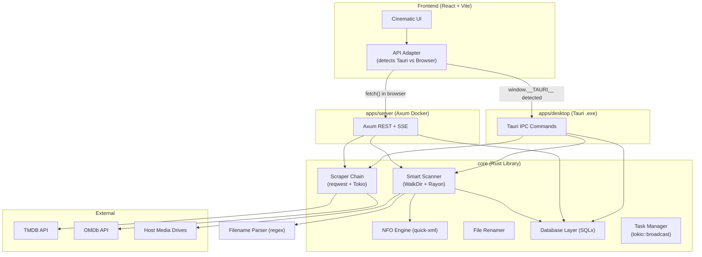

# Architecture & Technical Design: Media Manager

This document consolidates the system design, application architecture, and core feature specifications.

---

## 1. System Design (Rust / Tauri Edition)

> **Stack:** Rust · Tauri · Axum · React · SQLite (SQLx)

### High-Level Architecture
The system is a **Cargo Workspace Monorepo**. A single shared Rust library (`core`) holds all business logic. Two thin wrappers expose it as either an HTTP API (Docker) or Tauri IPC commands (Windows `.exe`). A single React frontend works in both via an **API Adapter Pattern**.

### Component Mapping: Python → Rust
| Python Module | Rust Equivalent | Key Crates |
|---|---|---|
| `scanner.py` | `core::scanner` | `walkdir`, `rayon` |
| `parser.py` | `core::parser` | `regex` |
| `scraper/chain.py` | `core::scraper` | `reqwest`, `tokio` |
| `nfo.py` | `core::nfo` | `quick-xml`, `serde` |
| `renamer.py` | `core::renamer` | custom template |
| SQLAlchemy | `core::db` | `sqlx` |
| FastAPI | `apps/server` | `axum` |

---

## 2. Application Architecture

### Core Library Structure
- **`core/src/models/`**: Domain entities (Movie, TVShow, Episode).
- **`core/src/db/`**: SQLx queries and migrations.
- **`core/src/scanner/`**: Parallel ingestion engine.
- **`core/src/scraper/`**: Multi-source metadata enrichment.
- **`core/src/task_manager/`**: Real-time progress broadcasting.

### Concurrency Model
- **Parallel Scanning**: Uses `rayon::par_iter()` for CPU-bound filename parsing.
- **Async I/O**: Uses `tokio` for network requests and database operations.
- **Task Updates**: Uses `tokio::sync::broadcast` to push updates to all listeners (SSE or Tauri Events).

---

## 3. Master Feature Specification

### Ingestion & Scanning
- **Fast Directory Sync**: Rapid file discovery using high-performance concurrency.
- **Watchdog (Real-time)**: Instant ingestion of new files via `notify`.
- **Intelligent Path Parsing**: Regex-based extraction of Title, Year, Season, and Episode.

### Enrichment & Scraping
- **Scraper Chain**: Concurrent fetching from TMDB, OMDb, and TVDB.
- **NFO Support**: Local-first metadata prioritization for 100% accuracy.
- **Artwork Management**: High-res posters and backdrops with local caching.
- **Subtitle Scraper**: Automated retrieval of matching .srt files.

### Management & Playback
- **Bulk Operations**: Multi-select UI for large-scale scraping and cleanup.
- **Dual Playback**: Support for native player launch and HLS adaptive streaming.
- **CLI Tool**: Headless management for advanced automation.
