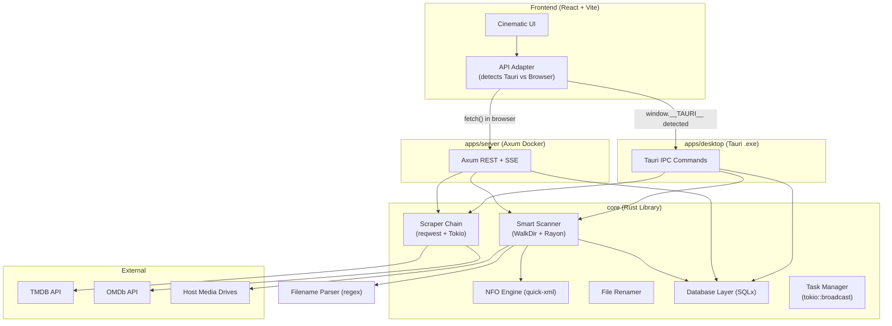
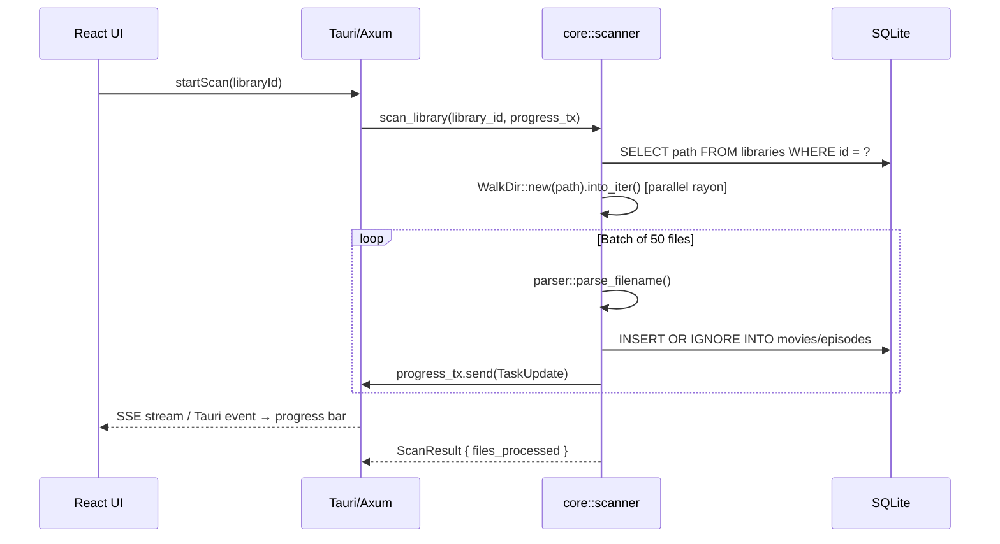

# Media Manager – System Design (Rust / Tauri Edition)

> **Architecture Version:** 1.0 | **Stack:** Rust · Tauri · Axum · React · SQLite (SQLx)

---

## 1. High-Level Architecture

The system is a **Cargo Workspace Monorepo**. A single shared Rust library (`core`) holds all business logic. Two thin wrappers expose it as either an HTTP API (Docker) or Tauri IPC commands (Windows `.exe`). A single React frontend works in both via an **API Adapter Pattern**.



---

## 2. The Cargo Workspace Monorepo

```
Cargo.toml                  ← [workspace] members = ["core", "apps/server", "apps/desktop"]
core/                       ← lib crate  (zero HTTP / IPC knowledge)
apps/server/                ← bin crate  (Axum, depends on core)
apps/desktop/               ← bin crate  (Tauri, depends on core)
```

**Golden Rule:** `core` must have **zero** knowledge of HTTP or Tauri. It only exposes plain async Rust functions. This is what makes the architecture dual-deployable.

---

## 3. Component Mapping: Python → Rust

| Python Module | Rust Equivalent | Key Crates |
|---|---|---|
| `scanner.py` (os.walk + ThreadPool) | `core::scanner` | `walkdir`, `rayon` |
| `parser.py` (regex) | `core::parser` | `regex` |
| `scraper/chain.py` (asyncio) | `core::scraper` | `reqwest`, `tokio` |
| `nfo.py` + `nfo_reader.py` | `core::nfo` | `quick-xml`, `serde` |
| `renamer.py` | `core::renamer` | custom template |
| `cleanup.py` | `core::cleanup` | `walkdir`, `sqlx` |
| SQLAlchemy + Alembic | `core::db` | `sqlx`, `sqlx-migrate` |
| `core/task_manager.py` (threading.Lock) | `core::task_manager` | `tokio::sync::broadcast` |
| FastAPI routers | `apps/server` routes | `axum` |
| Tauri (Phase 14 roadmap) | `apps/desktop` | `tauri` |

---

## 4. Data Flow: Library Scan



---

## 5. Real-Time Progress: Replacing Python SSE

| Concern | Python | Rust Server | Rust Desktop |
|---|---|---|---|
| **Channel** | `asyncio.Queue` | `tokio::sync::broadcast` | same sender |
| **Delivery** | `StreamingResponse` (SSE) | Axum `axum_extra::sse` | `window.emit()` |
| **Frontend** | `EventSource` API | `EventSource` API | `listen('task_update')` |
| **Thread safety** | `threading.Lock()` manual | Compiler-enforced | Compiler-enforced |

---

## 6. Docker Strategy (Rust Edition)

```dockerfile
# Stage 1: Build Rust binary
FROM rust:1.78-slim AS builder
WORKDIR /app
COPY . .
RUN cargo build --release -p server

# Stage 2: Build React frontend
FROM node:20-alpine AS frontend-builder
WORKDIR /app
COPY frontend/ .
RUN npm ci && npm run build

# Stage 3: Minimal runtime image
FROM debian:bookworm-slim
RUN apt-get update && apt-get install -y libssl3 ca-certificates && rm -rf /var/lib/apt/lists/*
COPY --from=builder /app/target/release/server /app/server
COPY --from=frontend-builder /app/dist /app/frontend/dist
EXPOSE 7878
CMD ["/app/server"]
```

**Target image size:** < 50MB (vs. ~400MB Python image)

---

## 7. Design Tenets

| Python Tenet | Rust Enhancement |
|---|---|
| Self-Contained Portability | SQLite WAL mode eliminates Windows host volume lock issues |
| Speed over Precision | WalkDir + Rayon gives 8–16x scan speed over Python `os.walk` |
| API Fallback Chain | Tokio `timeout()` + retry crate; no single API failure blocks ingestion |
| NFO Prioritization | `quick-xml` parses XML 50x faster than Python `xml.etree` |
| Zero-Copy Downloads | Axum Tokio streaming uses `sendfile(2)` on Linux same as Python `FileResponse` |
