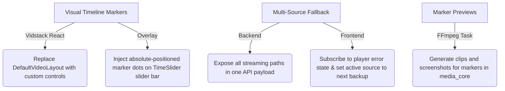

# 🎯 Feature Gap Analysis: Stash (Go) vs. Media Manager (Rust)

This document provides a technical comparison between **Stash** (a self-hosted media organizer written in Go) and **Media Manager** (a high-performance media manager written in Rust/Tauri). It identifies the key features present in Stash but missing in Media Manager, and explains how implementing them will benefit the Rust-based project.

---

## 📊 Feature Comparison Matrix

| Feature / System | Stash (Go) | Media Manager (Rust) | Parity Gap / Status | Priority |
| :--- | :--- | :--- | :--- | :--- |
| **Domain Model & DB Schema** | Structured Tables for `performers`, `studios`, `tags` (hierarchical) | Simple `movies` & `tv_shows` schema; cast is a flat string (`cast_list`) | **Out of Scope**: Flat string storage of cast is sufficient. | ⚪ Not Required |
| **Plugin System & Scrapers** | Dynamic Python/JS plugin runners & YAML scrapers; built-in package installer | Hardcoded scrapers in Rust binary (`OMDb`, `TMDB`, `TVDB`, `Trakt`) | **Out of Scope**: Hardcoded Rust scrapers are sufficient. | ⚪ Not Required |
| **Perceptual Hashing (pHash)** | Sampling-based video/image `pHash` for finding duplicates | Cryptographic `MD5` / `OSHash` only | **Missing Perceptual Duplication Engine**: Cannot detect re-encoded or resolution-changed duplicates. | 🟡 Medium |
| **Timeline Scene Markers** | Visual dots on progress bar; ranges; color-coded tags; click-to-jump | UI Bookmarks sidebar & creation modal exists; no visual timeline dots | **Missing Slider Integration**: Time slider on player does not visually show marker locations. | 🔴 High |
| **Marker Clip Previews** | Generates WebP/MP4 clip previews & screenshots at marker timestamps | Purely stores textual title and seconds in the database | **Missing Asset Generation**: Lacks marker-specific video/image rendering. | 🟡 Medium |
| **Multi-Source Fallback** | Auto-fallback to alternative streams (MP4/WebM/HLS) on player errors | Single source path injected into Vidstack | **Missing Player Resilience**: Playback crashes if the primary remux/HLS stream fails. | 🔴 High |
| **DLNA Server** | Built-in DLNA server to cast to local Smart TVs | Lacks network casting protocols | **Missing Casting Protocol**: Cannot cast videos directly to local network devices. | 🟢 Low |
| **Haptic / Interactive Sync** | Funscript support, dynamic speed heatmaps, device sync (e.g., TheHandy) | None | **Missing Haptic Logic**: Lacks support for interactive haptic scripts and device integration. | 🟢 Low |
| **VR / Panoramic Mode** | 180° / 360° video projection modes | Lacks VR projection | **Missing Projection Filters**: Cannot render VR video streams. | 🟢 Low |
| **Player System Utilities** | Wake Lock Sentinel & Media Session OS overlay integrations | Missing standard browser hooks | **Missing OS/Hardware Hook**: Screen can sleep during playback; media keys are not hooked to the OS. | 🟢 Low |

---

## 🔍 Detailed Gaps & How They Will Help Media Manager

### 1. Visual Scene Markers on Player Timeline
*   **How Stash does it:** Stash parses markers (timestamp + title + tag) and renders them as colored dots on the player's progress bar. It supports range markers (start to end times) and uses a Dynamic Programming algorithm (Interval Scheduling / MWIS) to stack overlapping range highlights on the timeline without cluttering.
*   **Media Manager's current state:** Media Manager has database support for markers (`media_core/src/db/migrations/020_add_scene_markers.sql`) and a bookmarks sidebar drawer in React (`VidstackPlayer.tsx`), but they are completely absent from the actual player timeline slider.
*   **How implementing this helps:**
    *   **Intuitive Navigation:** Users can instantly spot key chapters (e.g., "Intro", "Post-Credits Scene", "Action Sequence") directly on the seekbar and hover over them to see the title.
    *   **Dynamic Skipping:** Allows building features like "Skip Intro" or auto-looping specific parts of a movie.

### 2. Media Asset Generation for Scene Markers
*   **How Stash does it:** Stash runs background FFmpeg tasks to extract a video clip (short MP4), an animated preview (WebP), and a high-res screenshot (JPEG) specifically around a marker's timestamp. These are cached and served via dedicated streaming routes.
*   **Media Manager's current state:** Markers are purely database timestamps. No media assets are generated.
*   **How implementing this helps:**
    *   **Visual Bookmarking:** Rather than looking at a list of plain text bookmarks in a sidebar, users can browse their bookmarked scenes in a grid of cards displaying looping animated preview clips (like hovering over scenes on Netflix).

### 3. Robust Multi-Source Player Fallback
*   **How Stash does it:** Stash provides the frontend player with multiple stream alternatives (e.g., direct file path, fragmented MP4 transcode, WebM transcode, HLS stream). If one fails (e.g., Safari refuses fragmented MP4), a custom Video.js listener auto-advances to the next working source seamlessly.
*   **Media Manager's current state:** `VidstackPlayer.tsx` resolves a single `directUrl` from the backend and wraps it in a single-element source array. If that source fails, playback crashes with an error.
*   **How implementing this helps:**
    *   **Cross-Device Playback Stability:** Different browsers (Safari, Chrome, Firefox) and environments (desktop vs. mobile) support different codecs. If a direct high-bitrate stream fails to decode, falling back automatically to an HLS or transcoded MP4 stream guarantees uninterrupted playback.

### 4. Local Network Casting (DLNA Server)
*   **How Stash does it:** Stash includes a built-in UPnP/DLNA service, acting as a local media server.
*   **Media Manager's current state:** Media Manager runs purely as a local desktop Tauri application or an Axum web app without casting protocols.
*   **How implementing this helps:**
    *   **Smart TV Integration:** Users can discover the Media Manager server directly from their Smart TV, gaming console (PS5/Xbox), or local media players (like VLC on Apple TV) and stream content directly onto the big screen without needing a web browser interface.

---

## 🛠️ Implementation Plan: Bringing the Best Gaps to Rust

If you wish to implement these missing features, here is how the Rust + React stack can execute them:

